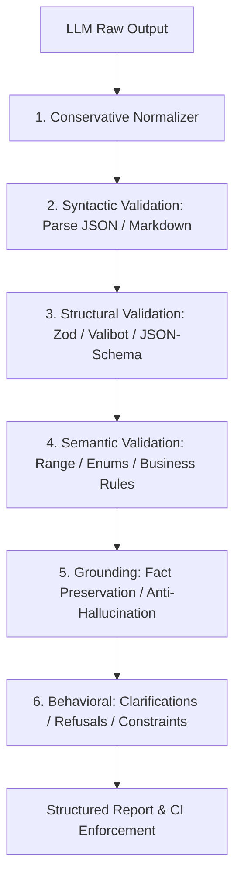

# llm-contract

[](https://www.npmjs.com/package/llm-contract)
[](https://github.com/alivirgo/LLM-Contract/actions/workflows/ci.yml)
[](https://github.com/users/alivirgo/packages/npm/package/llm-contract)
[](https://opensource.org/licenses/MIT)
[](https://www.typescriptlang.org/)

[Read the launch article: **Stop Shipping Broken AI: Contract Testing for LLMs in TypeScript**](https://medium.com/@alithetechguy/stop-shipping-broken-ai-contract-testing-for-llms-in-typescript-16e2b0e0dd56)

[Explore the interactive documentation](https://alivirgo.github.io/LLM-Contract/) for the quickstart, validation pipeline, regression workflow, CI policies, reports, and honest limits.

> Define what an AI system must do. Test it across real cases. Detect when a model, prompt, tool, or RAG change breaks the contract.

`llm-contract` is an open-source TypeScript library and CLI for deterministic-first LLM evaluation, AI agent testing, prompt regression, RAG grounding checks, structured-output validation, flakiness tracking, and CI gates.

Use it to express reusable behavioral requirements, evaluate generated output, run datasets repeatedly, compare results with a baseline, detect flaky cases, and enforce release thresholds in CI. It accepts outputs from any model or agent framework and makes no hidden network calls.

## When to use it

- Test a prompt or model migration before release.
- Catch regressions in AI assistants and tool-using agents.
- Validate JSON with Zod, Valibot, or a JSON Schema subset.
- Check required facts, forbidden claims, clarification, refusal, citations, ranges, enums, and business rules.
- Evaluate RAG answers against supplied context with transparent evidence.
- Track pass rate, score changes, new failures, fixes, and nondeterminism across a test dataset.
- Fail CI when critical AI behavior regresses.

## Why behavioral contracts?

- Exact text snapshots reject valid paraphrases.
- Schema validation cannot tell whether a structurally valid answer preserves facts or follows behavioral requirements.
- LLM judges are useful but probabilistic, so they should not overwrite deterministic failures.

`llm-contract` keeps those signals separate and returns an inspectable result containing checks, failures, warnings, scores, evidence, raw output, and normalized output.



---

## ⚡ Quickstart

### 1. Installation

```bash
npm install llm-contract
npx llm-contract init
npm run test:ai
```

That is the complete first-run path. `init` creates a small executable suite in
`evals/`, adds the `test:ai` script, and writes concise project guidance for
Cursor, Codex, Claude, Gemini, Antigravity, and other agents that read
`AGENTS.md`. It does not install a model SDK, make a network call, or require an
API key. Replace the sample outputs with output captured from the AI stack you
already use.

```bash
npx llm-contract init --dir ./my-app  # choose a project directory
npx llm-contract init --no-agents     # skip agent instruction files
npx llm-contract init --force         # replace initializer-owned targets
```

Optional schema validators can be added later with `npm install zod` or
`npm install valibot`.

The canonical package is [`llm-contract` on npmjs](https://www.npmjs.com/package/llm-contract). A public scoped mirror, [`@alivirgo/llm-contract`](https://github.com/users/alivirgo/packages/npm/package/llm-contract), is also published through GitHub Packages for authenticated GitHub registry workflows. Versioned tarballs are attached to [GitHub Releases](https://github.com/alivirgo/LLM-Contract/releases).

### 2. Customize the generated contract

```typescript
import { z } from 'zod';
import {
  defineContract,
  zodAdapter,
  mustPreserveFacts,
  mustNotInvent,
  mustAskWhenUncertain,
  assertNoContradiction,
  assertRequiredTopicsCovered,
  evaluate,
} from 'llm-contract';

// Define the expected output structure
const CustomerSupportSchema = z.object({
  reply: z.string(),
  category: z.enum(['refund', 'billing', 'technical', 'general']),
  requiresFollowUp: z.boolean(),
});

// Define the behavioral contract
export const supportContract = defineContract({
  name: 'customer-support-response',
  schema: zodAdapter(CustomerSupportSchema),
  normalization: {
    stripCodeFences: true, // strips ```json ... ``` without altering content
    trimWhitespace: true,
  },
  invariants: [
    // 1. Must faithfully preserve key facts (IDs, dates, numbers) from context
    mustPreserveFacts({ threshold: 1.0 }),

    // 2. Must not invent ungrounded claims absent from context
    mustNotInvent({ mode: 'strict' }),

    // 3. Must ask clarifying questions when input lacks essential parameters
    mustAskWhenUncertain({
      isAmbiguousInput: (input) => !input.orderId,
    }),

    // 4. Must never contradict facts in the context
    assertNoContradiction(),
  ],
  assertions: [
    // Soft evaluator: contributes to score without automatically hard-failing
    assertRequiredTopicsCovered(['refund', 'policy'], { weight: 0.5 }),
  ],
});
```

### 3. Evaluate Output

```typescript
const result = await evaluate(supportContract, {
  input: { query: 'Where is my package?' },
  context: 'Order ORD-9921 was shipped on 2026-09-01 via FedEx.',
  output: JSON.stringify({
    reply: 'Your order ORD-9921 was shipped on 2026-09-01 via FedEx.',
    category: 'general',
    requiresFollowUp: false,
  }),
});

console.log(result.passed); // true
console.log(result.score);  // 1.0
console.log(result.failures); // []
```

---

## 🔍 Structured Failure Taxonomy

Every failure produces a machine-readable code, exact path, human-readable explanation, and evidence:

| Failure Code | Meaning |
| :--- | :--- |
| `PARSE_ERROR` | Malformed JSON or invalid syntax |
| `SCHEMA_VIOLATION` | Zod, Valibot, or JSON Schema validation error |
| `MISSING_REQUIRED_INFORMATION` | Required parameters or topics missing |
| `UNSUPPORTED_CLAIM` | Output claims facts/entities absent from context |
| `FACT_CONTRADICTION` | Output directly contradicts context statements |
| `UNCERTAINTY_VIOLATION` | AI failed to ask for clarification on ambiguous input |
| `FORBIDDEN_PHRASE_DETECTED` | Banned term or hallucinated phrase found |
| `REQUIRED_TOPIC_MISSING` | Mandatory topic or concept omitted |
| `NUMERIC_OUT_OF_BOUNDS` | Structured numerical value outside bounds |
| `ENUM_VIOLATION` | Value not in allowed enum set |
| `REFUSAL_EXPECTED_BUT_MISSING` | Adversarial / unsafe input answered instead of refused |
| `UNEXPECTED_REFUSAL` | Benign prompt incorrectly refused |
| `CUSTOM_INVARIANT_FAILURE` | User-defined invariant check failed |

---

## 🧪 Dataset Regression Testing & CI Integration

The core superpower of `llm-contract` is running behavioral contracts across datasets before and after model or prompt changes.

```typescript
import { runSuite, evaluatePolicy, standardCIPolicy, formatSuiteTerminal } from 'llm-contract';

const cases = [
  {
    id: 'case-01',
    input: 'How do I return my item?',
    context: 'Returns are accepted at returns.store.com within 30 days.',
    contract: supportContract,
    baselineOutcome: { passed: true, score: 1.0 }, // Historical baseline
  },
  // ... more test cases
];

// Run suite against your model / generation function
const suiteResult = await runSuite('support-eval', cases, async (testCase) => {
  return await callMyModel(testCase.input, testCase.context);
}, {
  concurrency: 4,
  runsPerCase: 3, // Multi-run stability testing (detects flakiness)
});

// Enforce CI Policy
const policyResult = evaluatePolicy(suiteResult, standardCIPolicy);
console.log(formatSuiteTerminal(suiteResult, policyResult));

// Exit with non-zero code on CI policy violation
process.exit(policyResult.exitCode);
```

### 🚨 Prominent Regression Detection

`llm-contract` distinguishes an **absolute failure** from a **new regression**:

```
══════════════════════════════════════════════════════════════════════
  llm-contract suite: support-model-v2
══════════════════════════════════════════════════════════════════════

  Total Cases: 50   |   Passed: 48   |   Failed: 2
  Pass Rate:   96.0%   |   Avg Score: 97.5%   |   Duration: 420ms

  REGRESSIONS DETECTED (1)
  The following test cases passed in baseline but FAILED in current run:
    ✖ Case ID: case-12-refund-terms (Score: 0%, was 100%)
      ↳ [FACT_CONTRADICTION] Context states non-refundable, but output claims refundable

  FIXES DETECTED (2)
  The following test cases previously failed but now PASS:
    ✓ Case ID: case-04-clarification (Score: 100%)
```

---

## 📊 Stability & Flakiness Measurement

LLMs are probabilistic. Running a test once can hide nondeterminism:

- `runsPerCase: 3` runs each test case 3 times.
- `llm-contract` **never hides flakiness** by retrying until it passes.
- All attempts are recorded, and a `stabilityScore` (0.0 to 1.0) is reported.

---

## ⚖️ CI Policy Thresholds

Declare explicit acceptance policies:

```typescript
import { evaluatePolicy } from 'llm-contract';

const policyResult = evaluatePolicy(suiteResult, {
  name: 'Release Gate Policy',
  minimumPassRate: 0.95,          // >= 95% pass rate
  maximumRegressionRate: 0.00,    // 0 regressions allowed compared to baseline
  maximumFlakyRate: 0.05,         // max 5% flaky cases
  zeroToleranceFailures: [
    'SCHEMA_VIOLATION',
    'UNSUPPORTED_CLAIM',
    'FACT_CONTRADICTION',
  ],
});
```

---

## 🧰 Schema Adapters

`llm-contract` is framework-agnostic with first-class adapters:

### Zod
```typescript
import { z } from 'zod';
import { zodAdapter } from 'llm-contract/adapters/zod';

const schema = zodAdapter(z.object({ name: z.string(), score: z.number() }));
```

### Valibot
```typescript
import * as v from 'valibot';
import { valibotAdapter } from 'llm-contract/adapters/valibot';

const schema = valibotAdapter(v.object({ name: v.string(), score: v.number() }));
```

### Zero-Dependency JSON Schema Subset
```typescript
import { jsonSchemaAdapter } from 'llm-contract/adapters/json-schema';

const schema = jsonSchemaAdapter({
  type: 'object',
  required: ['name', 'score'],
  properties: {
    name: { type: 'string' },
    score: { type: 'number', minimum: 0, maximum: 100 },
  },
});
```

The built-in adapter intentionally supports the common deterministic subset
(`type`, `properties`, `required`, `additionalProperties`, arrays, enums, and
basic string/number bounds). It is not a complete JSON Schema implementation;
use Zod, Valibot, or a custom adapter when you need `$ref`, composition, or
draft-specific behavior.

---

## 🖥️ Command Line Interface (CLI)

```bash
# Run a dataset with a real executable behavioral contract
npx llm-contract run --suite ./cases.json --contract ./support.contract.mjs --baseline ./baseline.json --preset standard

# Generate an interactive HTML dashboard
npx llm-contract run --suite ./cases.json --contract ./support.contract.mjs --html ./dashboard.html

# Generate GitHub PR comment markdown
npx llm-contract run --suite ./cases.json --contract ./support.contract.mjs --markdown ./pr-summary.md

# Compare two evaluation runs to detect regressions
npx llm-contract compare --baseline ./run-v1.json --current ./run-v2.json

# Quick validation of a single output
npx llm-contract validate --input "Hello" --output "Hello world!"
```

The contract module must export a contract as its default export or as a named
`contract` export. Running without `--contract` performs only a non-empty-output
smoke check; it is useful for wiring CI, not for behavioral validation.

---

## 📁 Interactive HTML Dashboard

Generate self-contained HTML reports with zero CDN dependencies:

```bash
npx llm-contract run --suite ./cases.json --html ./report.html
```

Features:
- Dark/Light mode UI.
- Filter by All, Failed, Passed, Regressions, Fixes, or Flaky.
- Inspect raw vs normalized output and failure diffs.

---

## 🏗️ Architecture & Philosophy

1. **Deterministic Foundation**: Core checks (schema, entity preservation, range bounds, forbidden phrases) run in milliseconds without network calls or API keys.
2. **Conservative Normalization**: `rawOutput` is always preserved alongside `normalizedOutput`. Never silently rewrite semantic content.
3. **No Vendor Lock-In**: Works with OpenAI, Anthropic, Gemini, Mistral, Ollama, LangChain, LlamaIndex, or custom pipelines.
4. **Zero Telemetry**: No tracking, no hidden network requests, 100% private.

---

## 📄 License

MIT © 2026 llm-contract contributors
