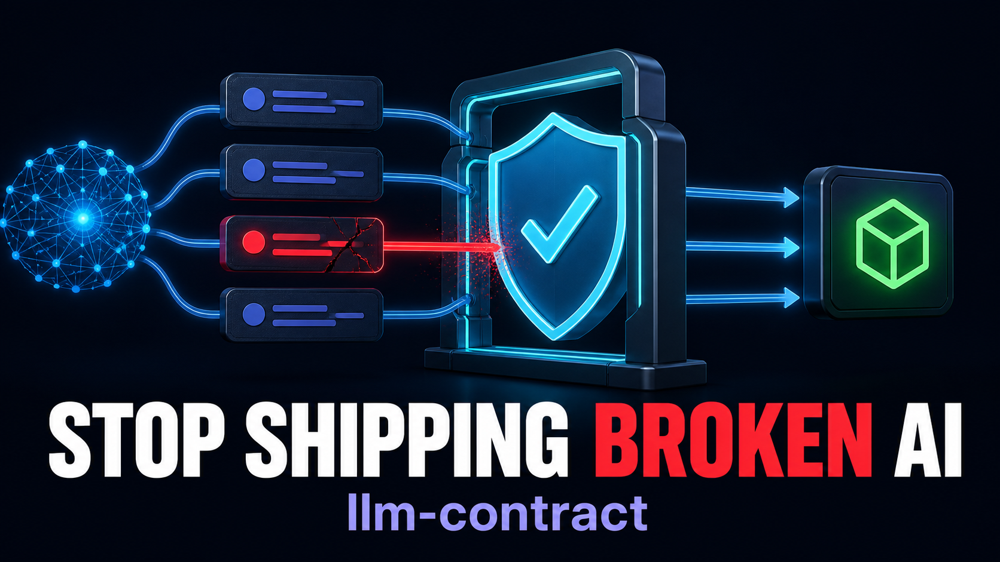

# Stop Shipping Broken AI: Contract Testing for LLMs in TypeScript

## Meet `llm-contract`, an open-source library and CLI for AI agent testing, prompt regression checks, RAG grounding validation, structured output, flakiness tracking, and CI release gates



Your test suite is green. The JSON parses. Every required field exists. Then the AI tells a customer that an order shipped on a date that never appeared in the source data.

That is the uncomfortable gap in many AI applications: **valid output is not necessarily correct behavior**.

A schema can prove that `orderId` is a string. It cannot prove that the model preserved the actual order ID. A parser can prove that a response is valid JSON. It cannot prove that the response asked for clarification when essential information was missing. And an exact text snapshot will fail as soon as a model produces a different—but equally correct—sentence.

I built [`llm-contract`](https://www.npmjs.com/package/llm-contract) to test the layer between structure and trust: the behavioral contract of an AI system.

```bash
npm install llm-contract
```

The package is open source, TypeScript-first, framework-agnostic, and available on [GitHub](https://github.com/alivirgo/LLM-Contract).

## The real regression problem with LLM applications

Traditional software returns the same result for the same input. Large language models do not. Their behavior can change when you modify almost any part of the surrounding system:

- the model or model version;
- the system prompt;
- tool descriptions;
- output schemas;
- temperature and sampling settings;
- retrieved documents;
- agent orchestration;
- safety instructions;
- or even the formatting of context.

The result may still look reasonable. It may even pass a schema while quietly dropping a fact, inventing an identifier, contradicting context, refusing a harmless request, or answering an ambiguous question without asking for the missing information.

That means an AI test should not usually ask, “Did I get this exact sentence?”

It should ask, “Did the output satisfy the requirements that matter?”

That is a contract.

## Five layers of AI output validation

`llm-contract` separates signals instead of hiding them inside one opaque quality score:

1. **Syntactic validation:** Can the output be parsed?
2. **Structural validation:** Does it satisfy a Zod, Valibot, or supported JSON Schema definition?
3. **Semantic validation:** Do values satisfy deterministic business rules such as ranges, enums, and required concepts?
4. **Grounding validation:** Are important identifiers and explicit facts supported by the supplied context?
5. **Behavioral validation:** Did the system clarify uncertainty, avoid forbidden content, preserve facts, cite sources, or refuse when required?

Every check produces inspectable results: pass/fail state, scores, stable failure codes, severity, evidence, paths, raw output, and normalized output.

The goal is not to manufacture a magical “AI quality” number. The goal is to show developers exactly what changed and why it matters.

## Define a behavioral contract in TypeScript

Here is a simplified customer-support contract:

```ts
import { z } from "zod";
import {
  defineContract,
  evaluate,
  zodAdapter,
  mustNotInvent,
  mustAskWhenUncertain,
  assertForbiddenPhrases,
  assertRequiredTopicsCovered,
} from "llm-contract";

const ResponseSchema = z.object({
  reply: z.string(),
  category: z.enum(["shipping", "refund", "billing", "other"]),
  needsFollowUp: z.boolean(),
});

const supportContract = defineContract({
  name: "support-response",
  schema: zodAdapter(ResponseSchema),
  normalization: {
    stripCodeFences: true,
    trimWhitespace: true,
  },
  invariants: [
    mustNotInvent({ mode: "strict" }),
    mustAskWhenUncertain({
      isAmbiguousInput: input =>
        typeof input === "object" &&
        input !== null &&
        !("orderId" in input),
    }),
    assertForbiddenPhrases(["guaranteed delivery"]),
  ],
  assertions: [
    assertRequiredTopicsCovered(["tracking"], {
      weight: 0.5,
    }),
  ],
});
```

Hard invariants determine whether the contract passes. Soft assertions can contribute weighted quality signals without erasing deterministic failures.

Now evaluate one output:

```ts
const result = await evaluate(supportContract, {
  input: {
    question: "Where is my order?",
    orderId: "ORD-9921",
  },
  context: "Order ORD-9921 shipped on 2026-09-01 via FedEx.",
  output: JSON.stringify({
    reply: "Order ORD-9921 shipped on 2026-09-01. Use FedEx tracking.",
    category: "shipping",
    needsFollowUp: false,
  }),
});

console.log(result.passed);
console.log(result.score);
console.log(result.failures);
console.log(result.evidence);
```

The result is machine-readable enough for automation and detailed enough for a developer to investigate.

## Test datasets, not anecdotes

One carefully chosen prompt is not a regression suite.

The stronger workflow is to collect representative cases: normal requests, ambiguous inputs, missing information, adversarial prompts, schema drift, unsupported claims, and correct paraphrases. Run the same cases before and after a model or prompt change.

```ts
import { runSuite } from "llm-contract";

const suite = await runSuite(
  "support-agent-v2",
  cases,
  async testCase => callYourModel(testCase.input, testCase.context),
  {
    runsPerCase: 3,
    concurrency: 4,
  },
);

console.log(suite.metrics.passRate);
console.log(suite.newlyFailingCases);
console.log(suite.flakyCases);
```

`llm-contract` compares meaningful assertion outcomes and structured failure signals—not natural-language wording alone. A differently worded correct answer can pass the same contract.

## Treat nondeterminism as data

Retries often make AI tests look healthier than they are. If a case fails twice and passes on the third attempt, reporting only the pass hides useful information.

Repeated suite runs in `llm-contract` preserve every attempt. The report includes stability metrics and marks cases as flaky when pass/fail outcomes vary. It does not retry until it finds a result you want.

That distinction matters in production. A behavior that succeeds 60% of the time is not a reliable behavior simply because one run happened to pass.

## Put behavioral regressions behind a CI gate

A suite can be checked against explicit release policies:

```ts
import {
  evaluatePolicy,
  standardCIPolicy,
} from "llm-contract";

const policy = evaluatePolicy(suite, standardCIPolicy);
process.exit(policy.exitCode);
```

Policies can enforce:

- a minimum pass rate;
- a maximum regression rate;
- a maximum flaky-case rate;
- a minimum average score;
- zero-tolerance failure categories;
- and per-category failure limits.

The CLI also supports dataset execution, baseline comparison, JSON output, terminal output, Markdown summaries, and self-contained HTML reports:

```bash
npx llm-contract run \
  --suite ./cases.json \
  --contract ./support.contract.mjs \
  --baseline ./baseline.json \
  --preset standard
```

The core package does not require OpenAI, Anthropic, Google, or any other provider SDK. You supply generated output or a generation function. No API key is required unless you deliberately configure an external evaluator.

## Why deterministic-first matters

LLM-as-a-judge evaluation can be valuable for nuance, style, and claims that cannot be reduced to exact rules. But the evaluator is another probabilistic model. It can drift, disagree with itself, cost money, and fail.

So `llm-contract` keeps deterministic failures authoritative. A judge cannot wave away malformed JSON, a missing required field, or a known factual contradiction.

This also makes the fast path suitable for local development and CI: no hidden network calls, no telemetry, and no surprise model bill.

## An honest note about hallucination detection

No deterministic library can universally determine whether arbitrary natural-language output is true.

`llm-contract` does not pretend otherwise.

Its built-in grounding checks are transparent, targeted signals for explicit identifiers and supported fact patterns. Assistive mode can flag suspicious content for review, and judge mode can use an external evaluator when probabilistic semantic assessment is appropriate. The evidence and confidence remain visible.

That limitation is a feature of honest tooling. A narrow, inspectable check is more useful than a grand promise nobody can verify.

## What I want this package to become

The first public release, `llm-contract` 0.9.0, already includes:

- reusable contracts and custom sync/async assertions;
- syntactic, structural, semantic, grounding, and behavioral checks;
- Zod, Valibot, and a documented JSON Schema subset;
- dataset suites and baseline comparison;
- repeated-run stability analysis;
- CI policies and stable failure codes;
- terminal, JSON, Markdown, and HTML reports;
- ESM and CommonJS builds;
- and a provider-agnostic CLI.

The project is MIT-licensed, tested across supported Node.js versions, and open to feedback and contributions.

If your AI feature matters enough to ship, its behavior matters enough to specify.

Define the contract before the next prompt or model change tells you what you forgot.

**Install:** [`npm install llm-contract`](https://www.npmjs.com/package/llm-contract)

**Source and documentation:** [alivirgo.github.io/LLM-Contract](https://alivirgo.github.io/LLM-Contract/)

---

Suggested Medium topics: Artificial Intelligence, Large Language Models, TypeScript, Software Testing, AI Agents
